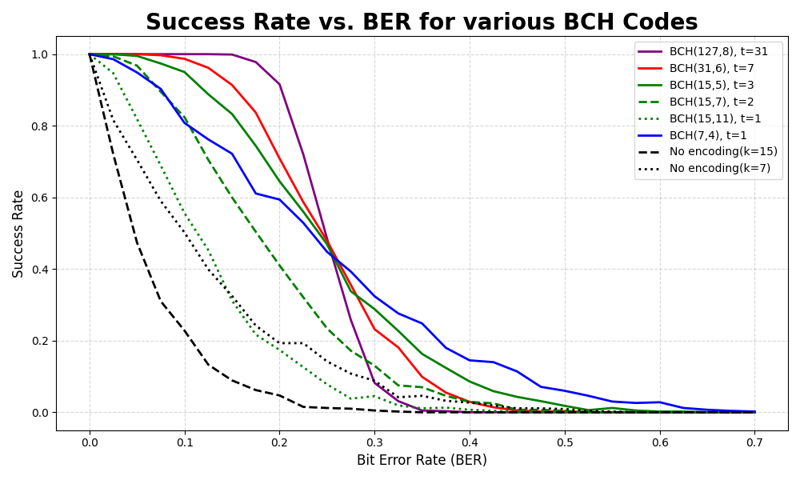
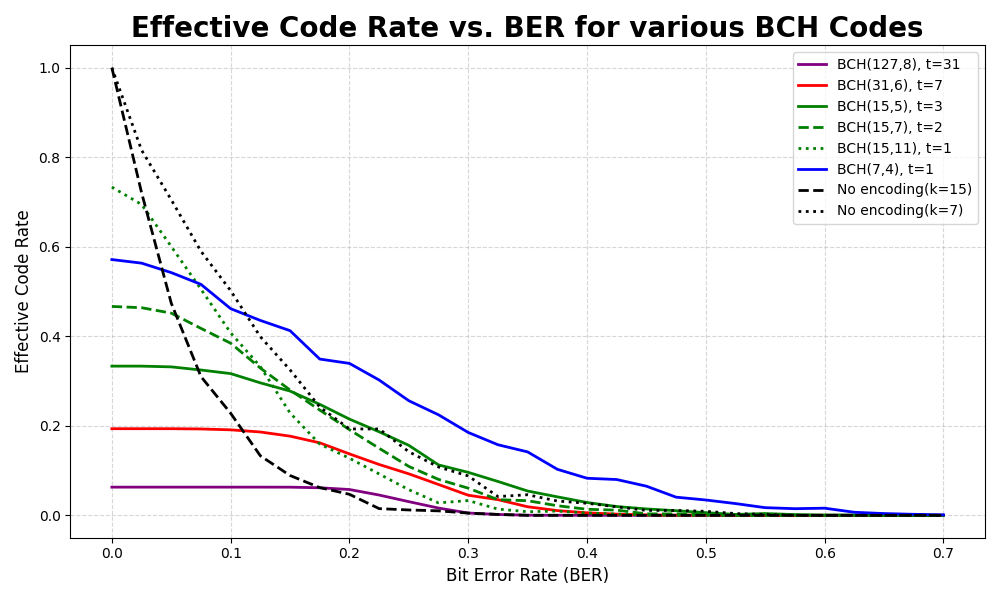
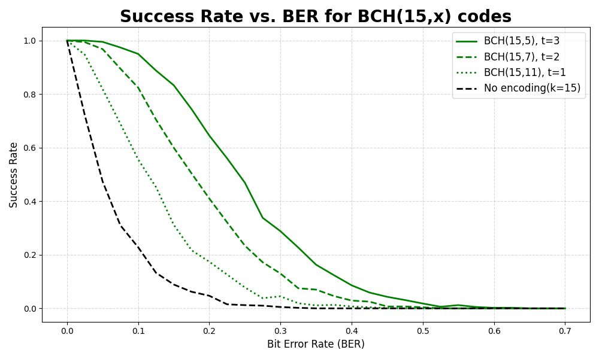
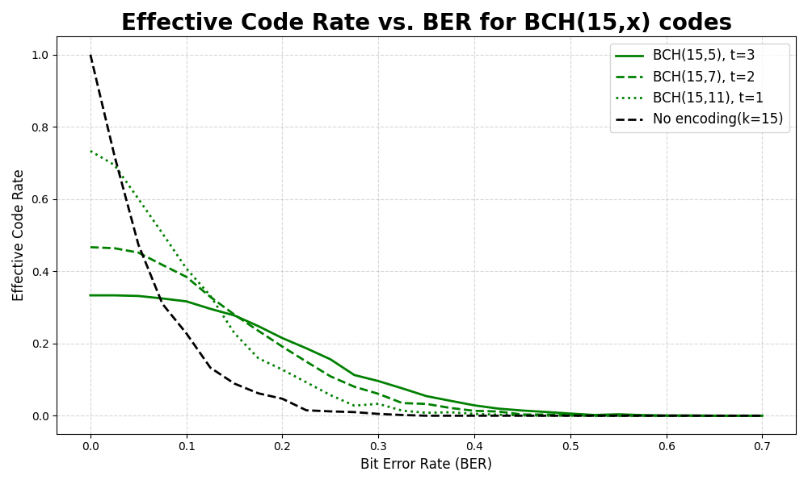

# BCH Transmission Simulation

A Python simulation framework for analyzing BCH (Bose-Chaudhuri-Hocquenghem) error-correcting codes performance across
various noise conditions, with comprehensive visualization tools for success rates and effective code rates.

## Quick Start

### Prerequisites

- Python 3.8+ installed on your system
- Git (to clone the repository)

### Setup & Installation

1. **Clone and navigate to the project**
   ```bash
   git clone <repository-url>
   cd BCH_transcoder
   ```

2. **Create and activate virtual environment**

   **Windows (PowerShell/CMD):**
   ```powershell
   python -m venv venv
   .\venv\Scripts\activate
   ```

   **macOS/Linux:**
   ```bash
   python -m venv venv
   source venv/bin/activate
   ```

3. **Install dependencies**
   ```bash
   python -m pip install --upgrade pip
   pip install -r requirements.txt
   ```

### Usage

1. **Try individual BCH codes** (interactive demo):
   ```bash
   python bch7_4.py
   ```

2. **Run full simulation** (generates CSV data):
   ```bash
   python transmission_simulation.py
   ```
   *Note: This may take several minutes to complete*

3. **Generate plots** (creates PNG visualizations):
   ```bash
   python plot_results.py
   ```

## Results and Visualizations

After running the simulation, the following plots are automatically generated:

### Success Rate vs Bit Error Rate (BER)



This plot shows how different BCH codes perform as the bit error rate increases. Higher success rates indicate better
error correction capability.

### Effective Code Rate vs BER



The effective code rate represents actual data throughput, accounting for both the code rate (k/n) and the
success rate at each BER level.

### BCH(15,x) Code Family Comparison




These plots focus on the BCH(15,x) family, comparing codes with different error correction capabilities.

## Key Insights

- **BCH(127,8)**: Highest error correction (t=31) but very low code rate
- **BCH(15,11)**: Highest information rate but minimal error correction (t=1)
- **BCH(15,5)**: Good balance for moderate error rates with t=3 correction
- All BCH codes significantly outperform unencoded transmission in noisy environments

## Available BCH Codes

| Code       | Parameters       | Error Correction Capability | Code Rate     |
|------------|------------------|-----------------------------|---------------|
| BCH(7,4)   | n=7, k=4, t=1    | 1 bit                       | 4/7 ~~ 0.57   |
| BCH(15,11) | n=15, k=11, t=1  | 1 bit                       | 11/15 ~~ 0.73 |
| BCH(15,7)  | n=15, k=7, t=2   | 2 bits                      | 7/15 ~~ 0.47  |
| BCH(15,5)  | n=15, k=5, t=3   | 3 bits                      | 5/15 ~~ 0.33  |
| BCH(31,6)  | n=31, k=6, t=7   | 7 bits                      | 6/31 ~~ 0.19  |
| BCH(127,8) | n=127, k=8, t=31 | 31 bits                     | 8/127 ~~ 0.06 |

## Troubleshooting

**Simulation takes too long:**

- Edit `transmission_simulation.py` and reduce `SAMPLE_SIZE` from 250 to 50-100
- Increase `BER_STEP` from 0.05 to 0.1 for fewer data points

## Testing

Run the test suite to verify everything works correctly:

```bash
python -m pytest tests/ -v
```

## Dependencies

- **galois**: Galois field arithmetic for BCH operations
- **matplotlib**: Plot generation
- **numpy**: Numerical computations
- **PyInputPlus**: Interactive input validation